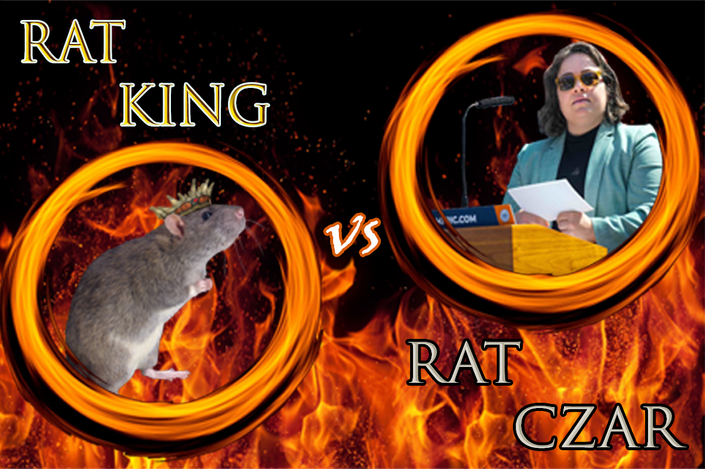

Welcome to our final project for Fall 2023's P8105 class! This project will take you through recent NYC data on rats and more- maybe you will learn something to avoid these furry foes.

## Welcome!
To make a long story short, we're interested in finding out if the rats really do run this city. Through our research, data tidying, analyses, and conclusions, we've tried to answer the question. Check out the rest of the website to see if you agree!

## Screencast
This short screencast lays out what information is on our website and walks through how to navigate the site.

`r #can update this later with the direct embed code from youtube video`
<iframe width="560" height="315" src="https://www.youtube.com/embed/cosTXRzBb0E" title="How NYC Became a Rat Kingdom 🐀" frameborder="0" allow="accelerometer; autoplay; clipboard-write; encrypted-media; gyroscope; picture-in-picture; web-share" allowfullscreen></iframe>