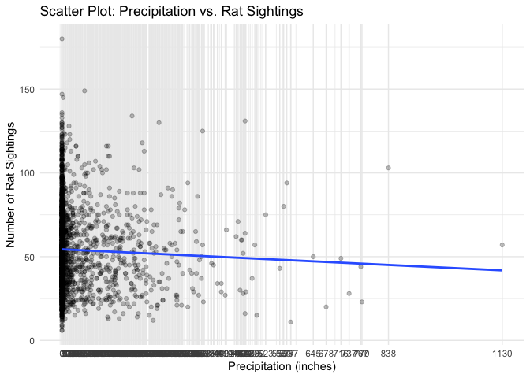
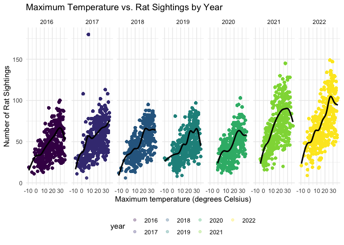

Rats & Weather Analysis
================

``` r
library(tidyverse)
library(ggplot2)
library(plotly)
```

``` r
sightings = read_csv('data/NYC_Rat_Sightings.csv') |> 
  janitor::clean_names() |> 
  separate(created_date, into=c("month","e", "day","f", "year", "g", "time"), sep=c(2,3,5,6,10,11)) |> 
  select(-e,-f,-g) |> 
  mutate(date = paste(year, month, day, sep=""), 
         date = as.numeric(date)) |>  
  filter(date <= 20231031, date >= 20160101, !incident_zip <= 10000, !incident_zip >11697, !borough %in% c("Unspecified", NA)) |> 
  select(-agency, -agency_name, -complaint_type, -descriptor, -landmark, -facility_type, -park_facility_name, -vehicle_type, -taxi_company_borough, -taxi_pick_up_location, -bridge_highway_name, -road_ramp, -bridge_highway_segment, -bridge_highway_direction) |> select(unique_key, date, year, month, day, everything())
```

    ## Warning: One or more parsing issues, call `problems()` on your data frame
    ## for details, e.g.:
    ##   dat <- vroom(...)
    ##   problems(dat)

    ## Rows: 232143 Columns: 38
    ## ── Column specification ───────────────────────────────────────────
    ## Delimiter: ","
    ## chr (25): Created Date, Closed Date, Agency, Agency Name, Complaint Type, De...
    ## dbl  (6): Unique Key, Incident Zip, X Coordinate (State Plane), Y Coordinate...
    ## lgl  (7): Vehicle Type, Taxi Company Borough, Taxi Pick Up Location, Bridge ...
    ## 
    ## ℹ Use `spec()` to retrieve the full column specification for this data.
    ## ℹ Specify the column types or set `show_col_types = FALSE` to quiet this message.

``` r
weather_df = rnoaa::meteo_pull_monitors(
    c("USW00094728"),
    var = c("PRCP", "TMIN", "TMAX"), 
    date_min = "2016-01-01",
    date_max = "2022-12-31") |>
  mutate(
    name = recode(id, USW00094728 = "CentralPark_NY"),
    tmin = tmin / 10,
    tmax = tmax / 10) |>
  select(name, id, everything())
```

    ## using cached file: /Users/lizbekerman/Library/Caches/org.R-project.R/R/rnoaa/noaa_ghcnd/USW00094728.dly

    ## date created (size, mb): 2023-12-02 11:00:44.015667 (8.544)

    ## file min/max dates: 1869-01-01 / 2023-11-30

``` r
sightings$date <- as.Date(as.character(sightings$date), format = "%Y%m%d")

rat_weather =
  right_join(sightings, weather_df, by="date")
```

Temperature and precipitation will likely impact rat behavior and
movement. Rats may be more active during certain weather conditions,
seeking shelter or food. Understanding how weather conditions influence
rat behavior can help identify high-risk periods for increased rat
activity. Policy-makers such as the Rat Czar can use this information to
allocate resources and implement targeted interventions during these
times. Moreover, as climate change leads to shift in weather patterns,
it will become even more important to adapt rat-control strategies to
changing environmental conditions.

First, we’ll see how amount of precipitation is associated with number
of rat sightings.

``` r
rat_weather |>
  filter(prcp != 1811) |>
  mutate(prcp = as.factor(prcp)) |>
  group_by(date, prcp) |>
  summarize(count = n()) |>
  mutate(prcp_numeric = as.numeric(as.character(prcp))) |>
  ggplot(aes(x = prcp_numeric, y = count)) +
  geom_point(alpha = 0.25) +
  geom_smooth(method = "glm", formula = y ~ x, se = FALSE) +
  scale_x_continuous(breaks = unique(as.numeric(as.character(rat_weather$prcp))),
                     labels = unique(rat_weather$prcp)) +
  labs(title = "Scatter Plot: Precipitation vs. Rat Sightings",
       x = "Precipitation (inches)",
       y = "Number of Rat Sightings")
```

    ## `summarise()` has grouped output by 'date'. You can override using
    ## the `.groups` argument.

<!-- -->

In this plot we can see an inverse relationship between precipitation
and rat sightings. This could mean that rats are less active during
periods of rain, potentially preferring to stay in sheltered areas, or
simply that people are less likely to go outside during times of high
precipitation, leading them to not report as many rat sightings.

Next, let’s see how number of rat sightings changes with maximum
temperature.

``` r
rat_weather |>
  group_by(date) |>
  summarize(count = n(), year, tmax) |>
  ggplot(aes(x = tmax, y = count, color = year)) + 
  geom_point(alpha = .3) +
  geom_smooth(se = FALSE, color="black") + 
  facet_grid(. ~ year) +
  labs(title = "Maximum Temperature vs. Rat Sightings by Year",
       x = "Maximum temperature (degrees Celsius)",
       y = "Number of Rat Sightings")
```

    ## Warning: Returning more (or less) than 1 row per `summarise()` group was
    ## deprecated in dplyr 1.1.0.
    ## ℹ Please use `reframe()` instead.
    ## ℹ When switching from `summarise()` to `reframe()`, remember that
    ##   `reframe()` always returns an ungrouped data frame and adjust
    ##   accordingly.
    ## Call `lifecycle::last_lifecycle_warnings()` to see where this
    ## warning was generated.

    ## `summarise()` has grouped output by 'date'. You can override using
    ## the `.groups` argument.
    ## `geom_smooth()` using method = 'gam' and formula = 'y ~ s(x, bs =
    ## "cs")'

<!-- -->

In the above graph, we see an overall increase in number of rat
sightings over the years, with annual peaks in number of sightings at
~25 degrees Celsius. This provides evidence of the need for increased
pest-control interventions during the warmer months, and an even greater
concern due to increasing temperatures caused by climate change.
